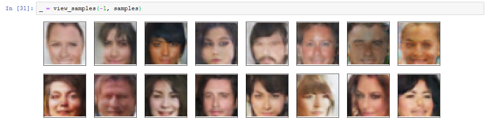

Generative Adversial Neural Network (GAN) defined and train to generate new Faces. This project was completed as part of Udacity's Deep Learning Nanodegree program.

# Project Overview
This project focuses on creating a GAN in PyTorch that can learn to generate new Faces.

## Notebook Sections
1. Load in Dataset
2. Pre-Process Dataset
3. Explore dateset
4. Batch Data & Create Dataloader
5. Define Model
6. Initialize weights
7. Model training
8. Generating Faces 

## Example Script Output:

